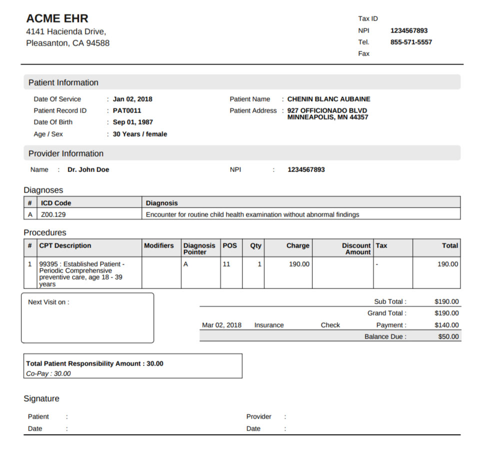
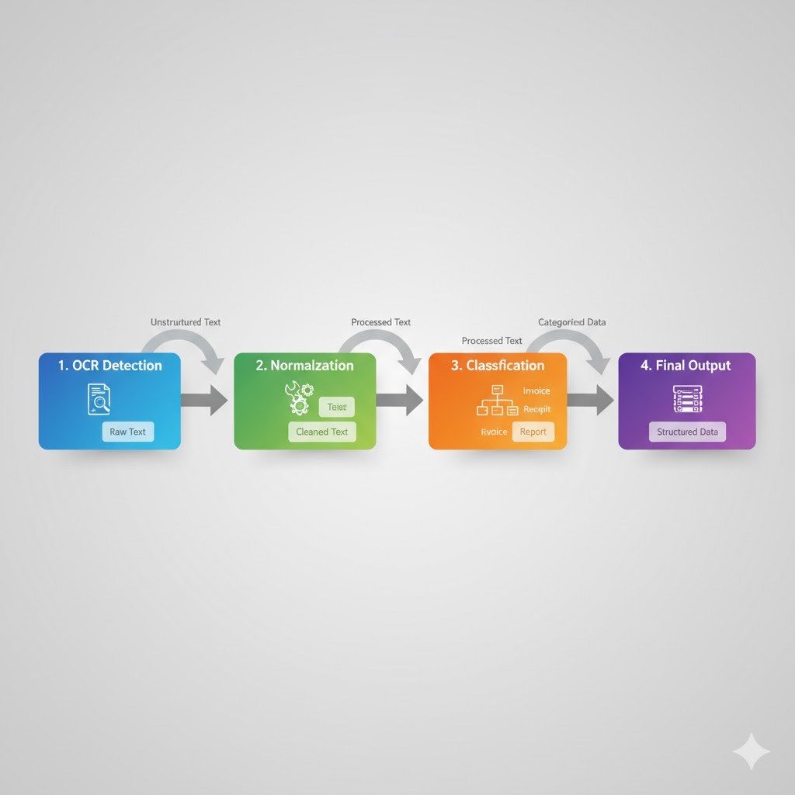
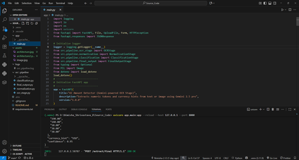
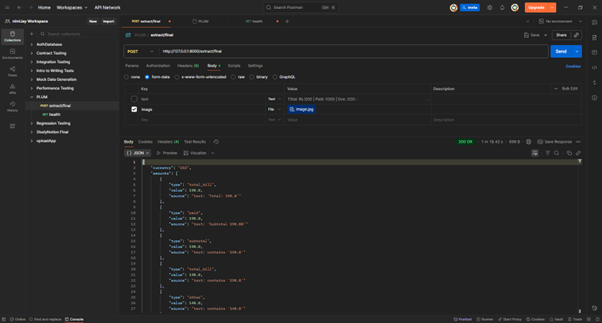
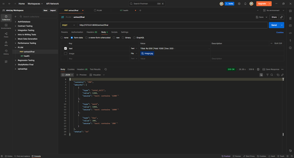
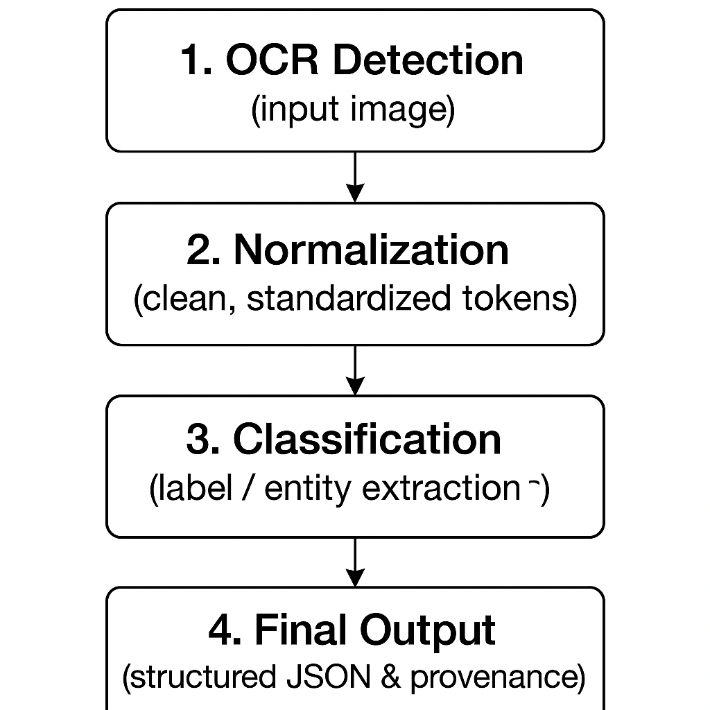

# AI Amount Detector

AI-Powered Amount Detection for medical documents (bills/receipts). The system extracts numeric tokens via OCR, normalizes/corrects them, classifies each value by context (total/paid/due/etc.), and assembles a final, provenance-backed JSON output. Built with FastAPI and Google Gemini.
GitHub: https://github.com/Nimisha-2-O/ai-amount-detector.git

## Tech Stack

- Backend: FastAPI (Python)
- OCR: Tesseract via `pytesseract` (requires Tesseract install)
- Image preprocessing: OpenCV
- Model reasoning: Google Gemini 2.5 Pro (`google-generativeai`)
- Config: `python-dotenv`
- Optional utilities: `rapidfuzz`, `pyngrok` (tunneling)

## Setup (Windows, PowerShell)

1. Install Python 3.10+ and Git
2. Install Tesseract OCR and note the install path (e.g. `C:\\Program Files\\Tesseract-OCR\\tesseract.exe`)
3. Clone the repo and create a virtual environment
   - `python -m venv .venv`
   - `\.venv\Scripts\Activate.ps1`
4. Install dependencies
   - `pip install -r requirements.txt`
5. Configure environment
   - Set `GEMINI_API_KEY` in your environment or `.env`
   - Optional: `NORMALIZATION_USE_GEMINI=true` to enable LLM fallback in normalization
   - Optional: `FINAL_SNIPPET_USE_GEMINI=true` to enable LLM-based provenance snippets
6. Ensure Tesseract path is correct
   - In `src/pipeline/ocr_stage.py`, update `pytesseract.pytesseract.tesseract_cmd` if needed
7. Run the API server
   - `uvicorn app.main:app --reload --host 127.0.0.1 --port 8000`
8. Final API
   - `http://127.0.0.1:8000/extract/final`

Environment variables supported:

- `GEMINI_API_KEY` (required)
- `NORMALIZATION_USE_GEMINI` (default `false`)
- `FINAL_SNIPPET_USE_GEMINI` (default `false`)

Logs are written to `logs/ocr_pipeline.log`.

## Repository Structure

- `app/main.py` — FastAPI service and endpoints
- `src/pipeline/ocr_stage.py` — OCR + Gemini extraction
- `src/pipeline/normalization.py` — numeric cleaning/normalization (+ optional LLM fallback)
- `src/pipeline/classification.py` — Gemini-based context classification
- `src/pipeline/final_output.py` — final JSON assembly with provenance
- `logs/ocr_pipeline.log` — runtime logs for gemini response of ocr

## Architecture & State Management

The system is a four-stage pipeline:

1. OCR Stage (`OCRStage`):
   - Input: text or image. If image, runs OpenCV preprocessing + Tesseract to get text.
   - Sends text to Gemini to extract `raw_tokens`, `currency_hint`, and a confidence.
2. Normalization Stage (`NormalizationStage`):
   - Deterministically cleans tokens (fix OCR digit confusions, strip currency/words, handle separators) and parses numbers.
   - Optionally calls Gemini to correct ambiguous tokens in batch.
3. Classification Stage (`ClassificationStage`):
   - Prompts Gemini with source text and normalized numbers to assign labels like `total_bill`, `paid`, `due`, etc.
4. Final Output Stage (`FinalOutputStage`):
   - Combines outputs and attaches a short provenance snippet per value (LLM or deterministic fallback).

State management: the API is stateless. Pipeline objects (`OCRStage`, `NormalizationStage`, `ClassificationStage`, `FinalOutputStage`) are initialized at process start and reused (in-memory). All configuration is injected via environment variables; no session/state is stored between requests.

## API Usage Examples

Base URL: `http://127.0.0.1:8000`

### POST /extract

Extract amounts from text or image (OCR + Gemini extraction only).

Text example:

```
curl -X POST http://127.0.0.1:8000/extract \
  -F "text=Total INR 1,250.00 Paid 1000 Due 250"
```

Image example:

```
curl -X POST http://127.0.0.1:8000/extract \
  -F "image=@assets/image.jpg"
```

### POST /extract/normalize

Run OCR/extraction, then normalization; returns compact normalized output by default.

```
curl -X POST "http://127.0.0.1:8000/extract/normalize?verbose=true" \
  -F "text=Subtotal 1000 GST 50 Total 1050 Paid 1000 Due 50"
```

### POST /extract/classify

Run OCR → normalization → classification; returns labeled amounts.

```
curl -X POST http://127.0.0.1:8000/extract/classify \
  -F "text=Total 1200 Paid 1000 Due 200"
```

### POST /extract/final

Run the full pipeline and return final assembled JSON with provenance.

```
curl -X POST http://127.0.0.1:8000/extract/final \
  -F "text=Total 1200 Paid 1000 Due 200"
```

### Testing with Postman

You can test the same endpoints in Postman either by importing the API schema or by creating requests manually:

  - Base URL: `http://127.0.0.1:8000`
  - Content type: use Body → form-data
  - Endpoints:
    - POST `/extract/final`
    - One of:
      - Key `text` as Text value (e.g., `Total INR 1,250.00 Paid 1000 Due 250`)
      - Key `image` as File (choose any image of medical bill) eg. in assets folder
    - POST `/extract`
    - One of:
      - Key `text` as Text value (e.g., `Total INR 1,250.00 Paid 1000 Due 250`)
      - Key `image` as File (choose any image file) eg. in assets folder
    - POST `/extract/normalize`
      - Same body as `/extract`
      - Optional query param `verbose=true` (Params tab)
    - POST `/extract/classify`
      - Same body as `/extract`
    - GET `/health`

## Prompts Used & Refinements

You are an expert financial document parser specialized in reading text extracted from scanned
bills, receipts, and invoices (including hospital bills, restaurant receipts, and shopping invoices).

The text below may contain OCR errors such as:
- 'O' or 'o' instead of '0'
- 'I', 'l', or '|' instead of '1'
- 'S' instead of '5'
- Missing spaces, or broken numeric tokens (e.g., "3 70.40" instead of "370.40")

Your goal:
1. Identify all numeric or percentage values that represent financial amounts, totals, discounts,
   taxes, balances, or payments.
2. Correct likely OCR errors in numeric tokens.
3. Merge broken tokens into proper numeric values.
4. Detect the most likely currency hint (e.g., "INR", "USD", "EUR", etc.) from symbols or words in text.
5. Return only clean structured JSON, with no extra text or explanation.

Output must be a **strict JSON object** with the following schema:

{{
  "raw_tokens": [list of cleaned numeric or percentage strings],
  "currency_hint": "INR" | "USD" | "EUR" | null,
  "confidence": float (0.0 - 1.0)
}}

Guidelines:
- Keep the tokens in the same order they appear in the text.
- If you find duplicate numbers (like subtotal and total both same), still include both.
- Confidence should reflect how certain you are about the correctness of extraction.
- If you find no valid amounts, return exactly:
  {{"status": "no_amounts_found", "reason": "document too noisy"}}

Now analyze and extract from this text:
{text}

VERY IMPORTANT:
Respond with ONLY a valid JSON object — no markdown, no code fences, no explanations.
The output must start with '{{' and end with '}}' and be fully parseable by json.loads().


# High-level intent for each stage’s prompt:

- OCR extraction (Gemini): find financial amounts, correct OCR errors, infer currency, output strict JSON. Handles code-fence cleanup and JSON extraction.
- Normalization fallback (Gemini): batch-correct ambiguous tokens and return strict JSON mapping with explanations.
- Classification (Gemini): label each normalized amount as `total_bill`, `paid`, `due`, etc., with an overall confidence, strictly JSON.
- Final provenance (Gemini): given full text and a number, return the shortest clause evidencing that number; avoid percentages and unrelated separators.

# Key refinements embedded in prompts/code:

- Force strict JSON responses; strip/clean code fences if Gemini returns markdown.
- Reject percentage tokens during numeric parsing.
- Heuristics for thousands/decimal separators and OCR digit confusions.
- Deterministic snippet extraction fallback when LLM is disabled or uncertain.

## Known Issues & Potential Improvements

- Tesseract path is hardcoded in `src/pipeline/ocr_stage.py`, may work upon this to make it env driven.
- Gemini may return non-JSON text; we sanitize but adding structured response validation per schema would help.
- Normalization drops percentages by design; consider a separate field for percent rates (e.g., taxes).
- Improve currency detection beyond simple symbol/keyword hints.
- Add rate limiting and request size limits for images.

## Backend Architecture Diagram

text/image → OCR (Tesseract) → Gemini extract → normalized numbers → Gemini classify → final assembly (provenance) → JSON output


## Screenshots 
# Main-Screen

# Output screen for image input

# Output screen for text input

# Architecture

# Test sample image


